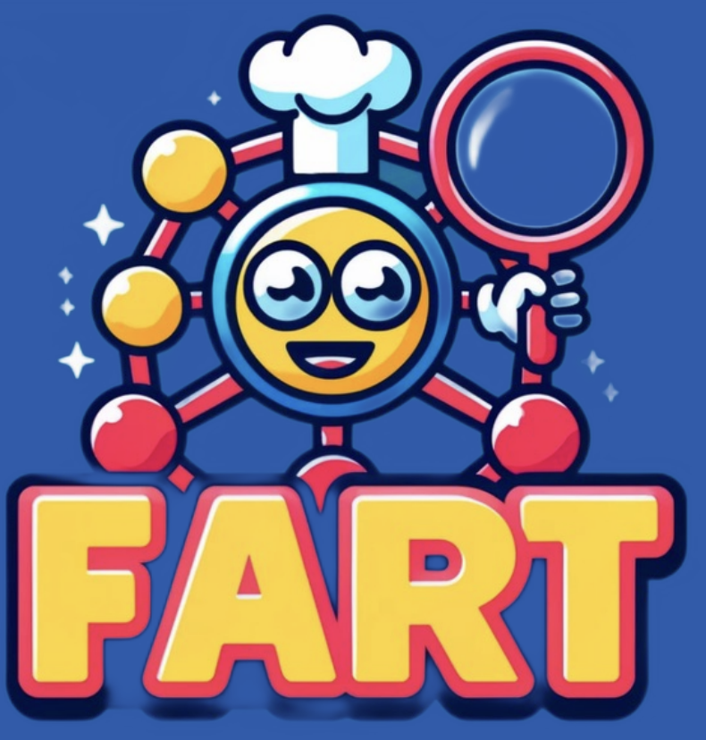

## About Me
Hi! I'm Leif (pronounced like "life", it's that easy) and it's great you're here. You'll have to figure out yourself why exactly. This website is mostly an archive of my own for my own but it's great if you find anything useful here. I was born in Germany, grew up near Lucerne in Switzerland and I am currently studying Interdiscplinary Sciences at ETH Zurich with a major in chemistry and computer science. 

You can find a copy of my [CV](assets/img/CV_Sieben_Leif.pdf) and my [LinkedIN](https://www.linkedin.com/in/leif-sieben-a694701b7/) profile. Feel free to reach out and connect!

## Education 
- MSc. Thesis at MIT in the group of Jim J. Collins. 
- MSc. in Interdisciplinary Sciences (Chemistry, Computer Science), ETH Zurich.
- BSc. in Interdisciplinary Sciences (Chemistry, Biology), ETH Zurich.
- Matura at Kantonsschule Alpenquai (bilingual, valedictorian), Luzern. 

## Research Projects
Here are the research projects that I have been involved in over the years. You can find an up-to-date list here at [Google Scholar](https://scholar.google.com/citations?user=JoZlcK0AAAAJ&hl=en&oi=ao) or via my [ORC-ID](https://orcid.org/0009-0002-9990-4896). 

- Master thesis - AI for antibiotics discovery, Prof. Jim J. Collins, MIT and Broad Institute. 
- A microfluidic assay for the inductive sensing of protease activity, Prof. Simone Schürle-Finke, ETH Zurich. 
- Bachelor Thesis - Chemoresistive Sensor for low-cost, high-sensitivity greenhouse gas detection. Prof. Máté Bezdek, ETH Zurich. 
- A numerical model for electron beam neutralization in gyrotrons, Dr. Ioannis Pagonnakis, ETH Zurich.
- Method Development for in-cell DNP Nuclear Magnetic Resonance. Prof. Alexander Barnes, ETH Zurich.

## Publications 
- A model of electron beam neutralization for gyrotron simulations, *Physics of Plasmas*, 2024.
- A Dye‐Sensitized Sensor for Oxygen Detection under Visible Light, *Advanced Science*, 2024.
- Electron Optics Simulation in the Overall Gyrotron Geometry, *Physics of Plasmas*, accepted.
- A fluidic device for continuous on-line inductive sensing of proteolytic cleavages, *Lab on a Chip*, 2025.
- A Chemical Language Model for Molecular Taste Prediction, *npj Science of Food*, 2025.
- A generative deep learning approach to de novo antibiotic design, *Cell*, 2025. 

Since 2024, I have been a senior research fellow at the student-led security-studies think tank [EPIS](https://www.epis-thinktank.de/). I have contributed an article on the future of biological warfare [What will biological warfare look like in the 21st century?](https://www.epis-thinktank.de/magazine/4/1).

## FART -- or how a computer tastes a molecule 

In 2024, a group of friends and I took a course in Digital Chemistry and started a group project together: training a machine learning model that could predict the taste of a molecule. Naturally, we named our transformer-based model the "Flavor Analysis and Recognition Transformer" or short -- FART. FART was actually the first model to predict the flavour of a molecule across five different taste categories in parallel and far exceeded the performance of any previous model at 91% accuracy. 

If you want to try it for yourself, there's an online interface available via [huggingface](https://huggingface.co/spaces/FartLabs/FART).

You can find the paper published in npj Science of Food [here](https://doi.org/10.1038/s41538-025-00474-z). 
The article was also very nicely discussed in The New Scientist: [Is this the best acronym in science? It's certainly the smelliest](https://www.newscientist.com/article/mg26735562-500-is-this-the-best-acronym-in-science-its-certainly-the-smelliest/). 

## A generative deep learning approach to de novo antibiotic design

During my Master thesis in the group of Jim Collins, we managed to make some major progress towards using generative AI in drug discovery. Generative AI in chemistry generally is a thorny issue: having a computer "dream up" molecular structures often leads to molecules that are either nearly impossible to make or that are one-hit-wonders that e.g. kill cancer cells but also every other cell in a patient's body. We investigated both older genetic algorithms and so-called variational autoencoders (VAE) to generate useful fragments for antibiotics discovery. Of the 24 compounds we ultimately synthesized, seven were active and two lead compounds showed efficacy against nasty, multi-drug resistant bacteria including MRSA. Our computational approach both increased hit rates tremendously (in drug discovery you can often test thousands of compounds without finding a single hit) and led us to explore completelye new molecular structures that a human would not have intuitively picked. 

You can read the full article published in *Cell* [here](https://doi.org/10.1016/j.cell.2025.07.033).

There's are also some really nice articles disscusing our work by the [BBC](https://www.bbc.com/news/articles/cgr94xxye2lo), [MIT News](https://news.mit.edu/2025/using-generative-ai-researchers-design-compounds-kill-drug-resistant-bacteria-0814), [Fierce Biotech](https://www.fiercebiotech.com/research/deep-learning-generative-ai-models-build-new-antibiotics-starting-single-atom) among others. 

## Teaching
Teaching is society's way to let smarty-pants cash in on their precociousness. I have amply provided the world with mine both cost-free and for gainly employment approximately since the day I learned how to talk. At ETH I have taught the following courses, giving a 45 min recitation each week for 15-25 people.

- Physical Chemistry I - Thermodynamics (2x)
- Inorganic Chemistry I - Coordination Chemistry
- Organic Chemistry I - Introduction to Organic Chemistry for Biologists
- Physical Chemistry III - Quantum Mechanics

## Philosophy of Science

I have been a contributing writer for both the Chemistry department's student newspaper "Exsikkator" and the ETH wide student newspaper "Polykum" writing a column on the philosophy of chemistry and science respectively. Some - but by no means all - of this writing was inspired by my own experiences in the lab. You can find a few examples below.

- [The Blobfish Scenario](assets/articles/Turbulent_Exsi_April23-4_TheBlobfishScenario.pdf). An article examining the quietest revolution that ever happened in science: the re-definition of all fundamental units. Could we (and would we) rediscover all our fundamental SI units in the case that our civilization suddenly ended and we had to start from scratch?
- [Consider the Electron](assets/articles/Toleranz_Exsi_Juni2023_ConsiderTheElectron.pdf). Is chemistry amoral? Are electrons moral patients? A serious answer to a silly question.
- [Zen and the Art of Molecule Making](assets/articles/Essenz_Exsi_Oktober2023_ZenAndTheArtOfMoleculeMaking.pdf). What is chemistry and what is the meaning of chemical thinking? A hypothesis on why chemists dislike the word "model" and thoughts on the philosophical relevance of the Ziegler-Natta catalyst.
- [How to Have Good Ideas Always](assets/articles/Trend_Exsi_December2023_HowToHaveGoodIdeasAlways.pdf). On Fritz Zwicky and the Morphological Method. Is there a method to creativity? An article on dark matter, jet engines and the globally optimal Muesli.

## TEDx Talk 2022

If your interested in the power of scientific thinking and my own story in science you can also take a look at the [TEDx talk](https://www.youtube.com/watch?v=rql940dY1b4) I gave a while back.

## Volunteering
- [Swiss Youth in Science](https://sjf.ch/) Organizes the national swiss science competition and helps get kids interested in STEM.
- [Jugend Debattiert](https://yes.swiss/en/programmes/youth-debate) Promotes debate in school and organizes regional and national debate competitions.
- [International Chemistry Olympiad 2023](https://www.icho2023.ch/) The international science olympiad for chemistry took place in Zurich 2023.
- I have been a contributing writer to two student newspapers at ETH running two regular columns on the philosophy of chemistry and of science more broadly. 
- The Margaret Fuller Neighbourhood House in Cambridge, MA. 

## The Apology of Nagarjuna

In my matura thesis, I treat the Buddhist philosopher Nagarjuna (ca. 2nd century CE) who was revolutionary in the development of Buddhism as he was the first philosopher willing to question the teachings of the Buddha and to put these onto an independent philosophical basement. His teaching remains enormously influential, if nearly completely unknown in the West, as he initiated the "reform Buddhism" known as Mahayana, which encompasses many of today's best known types of Buddhism such as Zen Buddhism. In this work I attempted to use and extend Boolean algebra developed by Graham priest to make Nagarjuna more understandable to a Western audience and to prove the point that his arguments do have philosophical and even logical rigour. Nagarjuna is by no means simply a esoteric thinker concerned with mystical enlightenment but a uniquely sharp and original philosopher in his own right.

- Please find the full text here [Matura thesis](assets/matura-thesis/MA.pdf)
- You can also find a poster from a presentation I gave here in German: [Poster](assets/matura-thesis/Poster SJF Version def.pdf)
- And a second poster (also in German) here: [Another Poster](assets/matura-thesis/PosterFokusMA.pdf)

## Alchemy

In 2023 I was involved in organizing a seminar on the topic of alchemy for the Swiss Study Foundation. The seminar was in part inspired by the amazing book by James Elkins "What painting is", a beautiful melange of art history, chemistry and why alchemy is such a powerful metaphor for oil painting, as well as the operette "Alchemy" by Roald Hoffmann, a chemist. The seminar included talks on the history of ideas, art history, chemistry and crucially also by living, practicing alchemists to a broad audience of young Swiss students. There were a number of outstanding talks there and I hope to continue working on this topic. If anyone is willing to collaborate on any topic related to this please, regardless your background, do reach out.

- Prof. Dr. Peter Forshaw, University of Amsterdam - Introduction to Alchemy
- Prof. Dr. Aden Kumlar, University of Basel - Transformations, Transsubstantiations: medieval ars and art
- Prof. Dr. Gerd Folkers - Is Chemistry the only Creative Science?
- Peter Cati - An Alchemical Distillatio
